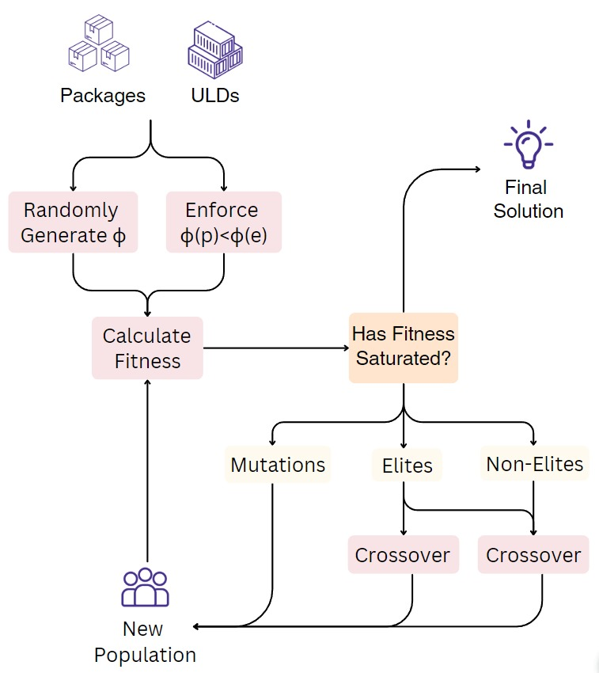

## Biased Random-Key Genetic Algorithm (BRKGA).

Biased Random-Key Genetic Algorithm (BRKGA) is a genetic algorithm that uses biased random-key encoding to represent the solution. It is a population-based algorithm that uses a combination of mutation, crossover, and selection to evolve the population of solutions.



We utilized the BRKGA-based algorithm from the [paper](https://www.sciencedirect.com/science/article/pii/S0925527313001837) for the 3D bin packing problem.


## How to run

The strategy can be run in two ways:

### Method 1: Modify the Configuration
Modify `main.config` file by changing the value `default_strategy` to `brkga`. This will configure the optimizer to use the BRKGA Strategy. 

### Method 2: Using the command line
```bash
python src/main.py -s brkga -d -v
```

## Configuration
The `brkga.config` file can be modified to configure the strategy.

```
{
    "number of generations" : integer, //The total number of generations to run the algorithm
    "number of individuals": integer, //The number of individuals in the population
    "number of elites": integer, //The number of elites in the population
    "number of mutants": integer, //The number of mutants in the population
    "fraction of biased population": float, //The fraction (between 0 and 1) of the population that is biased 
    "probability of choosing elite gene": float, //The probability (between 0 and  1) of choosing an elite gene
    "number of stable generations": integer //The number of generations to run without changing the best solution
}
```