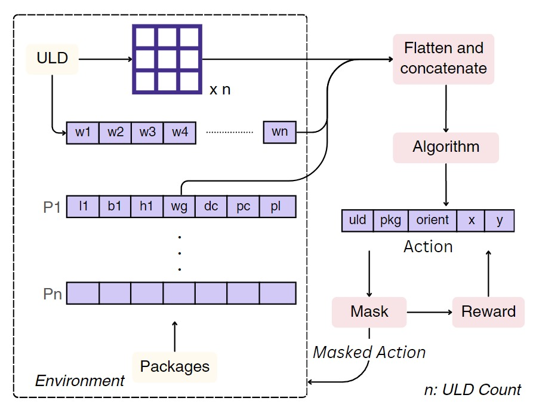

# Deep Reinforcement Learning (DRL) Strategy

This strategy aims to solve the problem using a Deep Reinforcement Learning approach. Reinforcement learning (RL) is a machine learning approach where an agent learns to make optimal decisions in an environment by maximizing rewards. Recently, RL has been applied to the bin packing problem, offering a promising alternative to traditional methods despite computational limitations. The experimental results demonstrate RL's potential to tackle complex resource allocation challenges more efficiently.




## How to Run

The strategy can be run in two ways:
### Method 1: Modify the Configuration

Modify `main.config` file by changing the value `default_strategy` to `drl`. This will configure the optimizer to use the DRL Strategy. 

### Method 2: Using the command line

```bash
python src/main.py -s drl -d -v
```

## Configuration
The `drl.config` file can be modified to configure the strategy.

```json
{
    "model_name": "PPO" | "A2C", //The model to use for the DRL strategy.
    "total_timesteps": integer, //The total number of timestamps to train the model
    "ent_coef": float, //The learning rate for the model
    "use_sde": boolean, //Whether to use the stochastic gradient descent method
    "learning_rate": float, //The learning rate for the model
    "sde_sample_freq": integer, //The frequency at which to update the covariance matrix of the Ornstein-Uhlenbeck process in th score function
    "gamma": float, // The discount factor for the model
}
```
