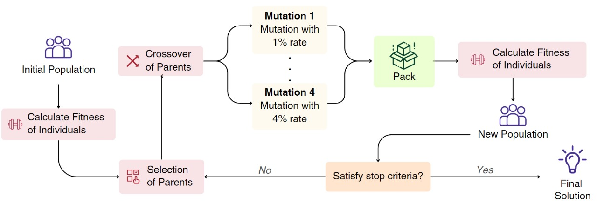

# Genetic Algorithm Strategy

## Overview

This genetic algorithm (GA) strategy is designed for solving a 3D bin packing problem with weight and priority constraints by optimizing package selection and packing. It encodes potential solutions as binary vectors, ensuring that a defined number of bits (representing packages) are active, to efficiently explore the solution space. The initial population is generated by prioritizing cost-efficient packages, while fitness evaluation considers both packing and discard costs. Crossover combines genetic traits from selected parents, guided by two different strategies to balance exploitation and exploration. Mutation introduces diversity by flipping bits with varying probabilities, using two distinct approaches to prevent premature convergence. Generational progression ensures high-quality solutions are retained or evolved, leading to optimized packing solutions through iterative refinement.



## How to run

The strategy can be run in two ways:

### Method 1: Modify the Configuration

Modify `main.config` file by changing the value `default_strategy` to `genetic_algorithm`. This will configure the optimizer to use the Genetic Algorithm Strategy. 

### Method 2: Using the command line

```bash
python src/main.py -s genetic_algorithm -d -v
```

## Configuration
The `drl.config` file can be modified to configure the strategy.

```json
{
    "number of generations" : integer, // The number of generations to run the Genetic Algorithm
    "number of individuals": integer, //The number of individuals in the population
    "mutation bracket size": integer, //The size of the mutation bracket
    "solver": "mhpa" | "threeD_bin_packing", //The solver used for packing
    "number of stable generations": integer, // he number of stable generations
    "probability of choosing elite gene": float //The probability (between 0 and 1) of choosing an elite gene
}
```
