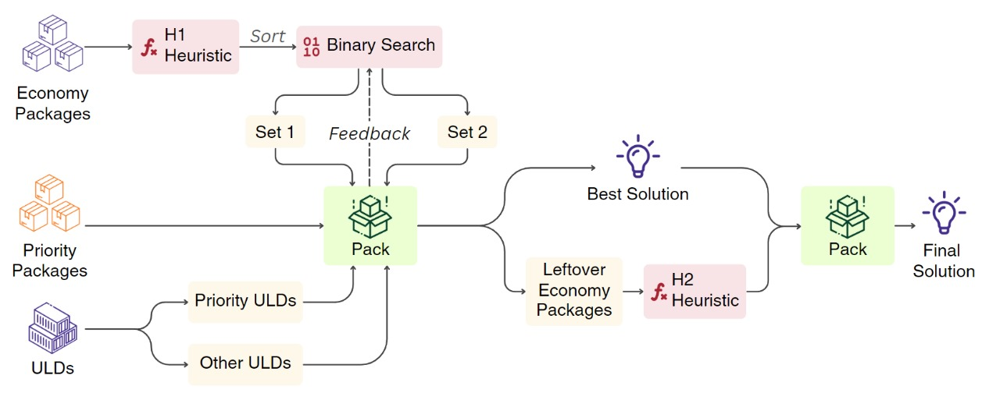

# Greedy Heuristic Strategy
This strategy is utilized for efficient ULD allocation, focusing on three steps: ULD Partition, Greedy Allocation, and Retroactive Allocation. The core of the strategy lies in clustering packages into ULDs using heuristics that specifically cater to the problem. These heuristics ensure that the packages with the highest delay costs and likelihood of being packed tightly are selected first. With these heuristics, we have developed an intuitive greedy algorithm that tries to fit the maximum number of “high cost-density” economy packages while ensuring that all the priority packages get allocated.



## How to run
The strategy can be run in two ways:
### Method 1: Modify the Configuration
Modify `main.config` file by changing the value `default_strategy` to `greedy_heuristic`. This will configure the optimizer to use the Greedy Heuristic Strategy. 

### Method 2: Using the command line
```bash
python src/main.py -s greedy_heuristic -d -v
```

## Configuration (`greedy_heuristic.config`)

The `greedy_heuristic.config` file can be modified to configure the strategy.
 

```json
{
    "solver": "mhpa" | "threeD_bin_packing", //Specifies the solver to use for packing
    "error tuning": integer //A parameter to control the flexibility in fitting packages into the ULDs during Retroactive Allocation
}
```